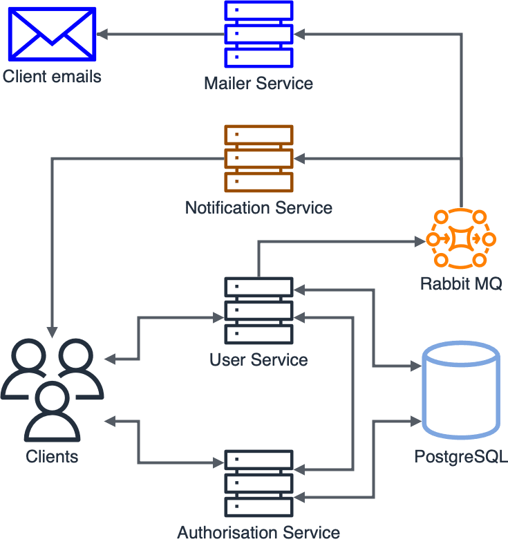
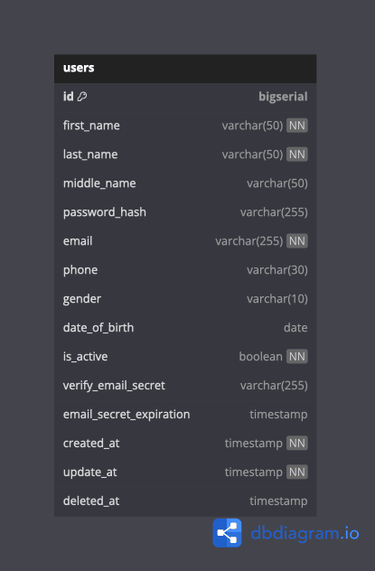

# Gamified Personal Manager Backend (GPMB)

## Overview

**Gamified Personal Manager (GPM)** - is an app designed to enhance productivity and personal growth through gamification principles.

By transforming daily tasks and goals into engaging challenges, GPM encourages users to develop positive habits, stay organized, and achieve their personal and professional objectives in a fun and interactive way.

## Backend Design



## Database Design



## Services

- [Authorization Service](./services/auth/README.md)
- [User Service](./services/user/README.md)

## Dependencies

| Name | Description | Version |
| :-: | :-- | :-: |
| [Husky](https://typicode.github.io/husky/) | Ultra-fast modern native `git` hooks | `9.1.6` |
| [Lint-staged](https://github.com/lint-staged/lint-staged#-lint-staged) | Linter for staged `git` files | `15.2.10` |
| [Docker](https://www.docker.com/) | A platform designed to help developers build, share, and run container applications | `27.2.0` |
| [Docker Compose](https://docs.docker.com/compose/) | A tool for defining and running multi-container applications | `2.29.2` |

## How to install

1. **Clone the repository** using the following command:

    ```bash
    # HTTPS
    git clone https://github.com/RenZorRUS/gpm-backend.git
    # SSH
    git clone git@github.com:RenZorRUS/gpm-backend.git
    ```

2. Download workspace dependencies using the following command:

    ```bash
    pnpm install
    ```

3. Initialize [`Husky`](https://typicode.github.io/husky/get-started.html#install) pre-commit checker tool using the following commands:

    > **NOTE:**
    >
    > Git pre-commit hooks [documentation](https://typicode.github.io/husky/how-to.html)
    >
    > Git include a `-n`/`--no-verify` option to skip hooks

    ```bash
    pnpm husky init
    echo 'pnpm test' > .husky/pre-commit
    echo 'pnpm lint:staged' >> .husky/pre-commit
    ```

4. Link the pre-commit checker to your `git` repository using the following command:

    ```bash
    pnpm prepare
    ```

## How to run

> **NOTE:** Before running the GPM backend, please install [Docker](https://docs.docker.com/get-started/get-docker/) platform.

1. Run multiple GPM backend `Docker` containers using the following command:

    ```bash
    docker compose up --detach --force-recreate --remove-orphans
    # To run containers with re-built images, use the following command:
    docker compose up --detach --force-recreate --remove-orphans --build
    ```

    If you want to launch only specific services, list them in the comment below:

    ```bash
    # docker compose up <OPTIONS...> <SERVICE_NAMES...> 
    docker compose up --detach --remove-orphans database message-queue
    ```

2. To shutdown the GPM backend `Docker` containers, use the following command:

    ```bash
    docker compose down --remove-orphans --volumes
    ```

## References

**Programming Languages:**

- [JavaScript Tutorial](https://javascript.info/)
- [TypeScript](https://www.typescriptlang.org/)
- [JSON Schema Docs](https://www.learnjsonschema.com/)
- [Are single-character constants better than literals?](https://softwareengineering.stackexchange.com/questions/324151/are-single-character-constants-better-than-literals)
- [Types vs. interfaces in TypeScript](https://blog.logrocket.com/types-vs-interfaces-typescript/#types-type-aliases)
- [What are generics in TypeScript?](https://prismic.io/blog/typescript-generics)
- [How To Use Generics in TypeScript](https://www.digitalocean.com/community/tutorials/how-to-use-generics-in-typescript)

**Architecture:**

- [Clean Architecture in TypeScript](https://youtu.be/f7Su4KoqSio?si=fJJpr4l8DtpptXbj)
- [Clean Architecture - An Introduction](https://www.dandoescode.com/blog/clean-architecture-an-introduction#domain-layer)
- [Fastify Clean Architecture](https://youtu.be/5zYzjzoTok4?si=cWS2jLY4qWjnHDdM)
- [Build a REST API with Fastify & Prisma](https://github.com/TomDoesTech/fastify-prisma-rest-api)
- [Proxy vs Reverse Proxy Explained](https://youtu.be/RXXRguaHZs0?si=299KTj2Uq9DCkQwh)
- [5 Examples of RESTful API Pagination in Production](https://nordicapis.com/4-examples-of-restful-api-pagination-in-production/)
- [How to manage multiple Front-End projects with a monorepo](https://www.pixelmatters.com/blog/how-to-manage-multiple-front-end-projects-with-a-monorepo)

**Docker:**

- [10 best practices to containerize Node.js](https://snyk.io/blog/10-best-practices-to-containerize-nodejs-web-applications-with-docker/)
- [How to Use the Postgres Docker Official Image](https://www.docker.com/blog/how-to-use-the-postgres-docker-official-image/)
- [How to install curl on Alpine Linux](https://www.cyberciti.biz/faq/how-to-install-curl-on-alpine-linux/)
- [How to reference a variable inside a `.env` file](https://dev.to/accreditly/how-to-reference-a-variable-inside-a-env-file-1bj7)

**Node Platform:**

- [The fastest Node web framework in 2024](https://medium.com/deno-the-complete-reference/node-js-the-fastest-web-framework-in-2024-fa11e513fa75)
- [Web Frameworks Benchmark](https://web-frameworks-benchmark.netlify.app/result?asc=0&l=javascript&order_by=level64)
- [A gigabytes-per-second JSON parser](https://github.com/luizperes/simdjson_nodejs#simdjson_nodejs)
- [Deep Dive into Undici](https://gitnation.com/contents/deep-dive-into-undici)
- [HTTP Fundamentals: Understanding Undici and its Working Mechanism](https://blog.platformatic.dev/http-fundamentals-understanding-undici-and-its-working-mechanism)
- [Building a modular monolith with Fastify](https://youtu.be/e1jkA-ee_aY?si=l30fAWooSOrvaOIS)
- [Do not thrash the Node event loop](https://youtu.be/VI29mUA8n9w?si=VWY6-7yVBbK73FnX)
- [Relative vs Absolute Imports in Node JS](https://medium.com/@osahonoboite/relative-vs-absolute-imports-in-node-js-d7e562c85f57)
- [JavaScript Visualized - Event Loop, Web APIs, (Micro)task Queue](https://youtu.be/eiC58R16hb8?si=rOuMIl4hwvuC_ciK)
- [JavaScript Visualized - Promise Execution](https://www.youtube.com/watch?v=Xs1EMmBLpn4)
- [Understanding the V8 JavaScript Engine](https://www.youtube.com/watch?v=xckH5s3UuX4)
- [Partnership with Garbage Collector. Memory in V8 and dealing with leaks](https://youtu.be/-BFRb_AzWHc?si=OPKUak8Dum2l44xt)
- [Working with npm workspaces](https://docs.npmjs.com/cli/v8/using-npm/workspaces)
- [Speeding up V8 regular expressions](https://v8.dev/blog/speeding-up-regular-expressions)

**ORMs:**

- [Example of a real world project adapted to use a multi-file Prisma Schema](https://github.com/prisma/dub)

**HTTP Protocol:**

- [HTTP HEAD Request Method](https://reqbin.com/Article/HttpHead)
- [What are HTTP Headers & Understand different types of HTTP headers](https://requestly.com/blog/what-are-http-headers-understand-different-types-of-http-headers/)

**Security:**

- [Cross-Origin Resource Sharing (CORS)](https://youtu.be/t5FBwq-kudw?si=Ic_7ohJO75vaM5YK)
- [Session vs Token Authentication](https://youtu.be/UBUNrFtufWo?si=Wx1s7LMWXnvm3B1J)
- [WTF is Bearer Token: An In-Depth Explanation](https://medium.com/@arunchaitanya/wtf-is-bearer-token-an-in-depth-explanation-60695b581928)
- [JSON Web Token Claims](https://auth0.com/docs/secure/tokens/json-web-tokens/json-web-token-claims)
- [Using jose-util with ed25519 (aka EdDSA), PEM-formatted, keys](https://gist.github.com/kousu/f3174af57e1fc42a0a88586b5a5ffdc9#using-jose-util-with-ed25519-aka-eddsa-pem-formatted-keys)

**Protocols:**

- [WebSockets Crash Course](https://youtu.be/2Nt-ZrNP22A?si=KW9CkljvhQLWW9Cw)
- [Transport Layer Security, TLS 1.2 and 1.3](https://youtu.be/AlE5X1NlHgg?si=sykf9P6FZ--KkRS0)

**Message Brokers (Queues):**

- [RabbitMQ Crash Course](https://youtu.be/Cie5v59mrTg?si=MoCuKI97k7lmPdyX)
- [RabbitMQ for beginners - What is RabbitMQ?](https://www.cloudamqp.com/blog/part1-rabbitmq-for-beginners-what-is-rabbitmq.html)
- [13 Common RabbitMQ Mistakes and How to Avoid Them](https://www.cloudamqp.com/blog/part4-rabbitmq-13-common-errors.html#:~:text=Don't%20open%20a%20channel,connection%20between%20threads%20with%20channels.)
- [RabbitMQ Best Practices](https://www.cloudamqp.com/blog/part1-rabbitmq-best-practice.html)

**Databases:**

- [Draw Entity-Relationship Diagrams](https://dbdiagram.io/home)
- [Learn PostgreSQL Tutorial - Full Course for Beginners](https://youtu.be/qw--VYLpxG4?si=1L28FXEOcPVbyWKE)
- [Mockaroo lets you generate up to 1,000 rows of realistic test data in CSV, JSON, SQL](https://www.mockaroo.com/#)
- [Difference between text and varchar (character varying)](https://stackoverflow.com/a/4849030/25203640)
- [PgBouncer Tutorial](https://youtu.be/ddKm7a7xOpk?si=N0Rfe6A5-OSOtlQN)
- [Relational Database ACID Transactions](https://youtu.be/pomxJOFVcQs?si=pfRkY20Mk_APg9KA)
- [All Postgres Locks Explained](https://www.youtube.com/watch?v=URwmzTeuHdk)
